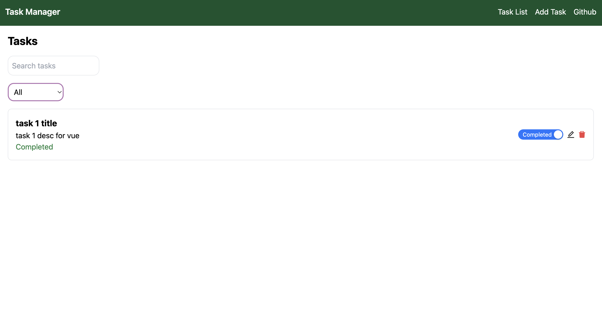

# Task Manager Vue Application

Bu proje, Vue.js kullanılarak geliştirilen bir görev yönetim uygulamasıdır. Kullanıcılar görevleri listeler, yeni görevler ekler, mevcut görevleri düzenler, siler ve tamamlama durumunu değiştirir. 



## Özellikler

- Görev listeleme
- Görev ekleme
- Görev düzenleme
- Görev silme
- Görev tamamlama durumu değiştirme

## Kullanılan Teknolojiler

- Vue.js 3
- Vuex for state management
- Vue Router for navigation
- Ant Design Vue for UI components
- Tailwind CSS for styling
- JSON Server for mock backend

## Nasıl Başlatılır

1. **Projeyi İndirin veya Klonlayın**
```
git clone https://github.com/YusraSenimAydin/task-manager-vue.git
cd task-manager-vue
```

2. **Bağımlılıkları Yükleyin**
```
npm install
```

3. **JSON Server'ı Başlatın**
```
 npx json-server --watch src/db.json --port 3000
 ```

4. **Uygulamayı Başlatın**
 ```
npm run serve
 ```


Uygulama [http://localhost:8080](http://localhost:8080) adresinde çalışmaya başlayacaktır.

## Uygulama Ekranları

- **Ana Sayfa** - Tüm görevlerin listelendiği ana sayfa.
- **Görev Ekleme Sayfası** - Yeni görev eklemek için kullanılan sayfa.
- **Görev Detayı ve Düzenleme** - Görevin detaylarını gösteren ve düzenlemeye izin veren sayfa.

## Katkıda Bulunma

1. Bu repo'yu forklayın.
2. Yeni bir branch oluşturun (`git checkout -b feature/branch-name`).
3. Değişikliklerinizi yapın.
4. Değişikliklerinizi commit edin (`git commit -am 'Add some feature'`).
5. Branch'ınıza push yapın (`git push origin feature/branch-name`).
6. Pull request oluşturun.

## Lisans

MIT License. Daha fazla bilgi için [LICENSE](./LICENSE) dosyasına bakabilirsiniz.
